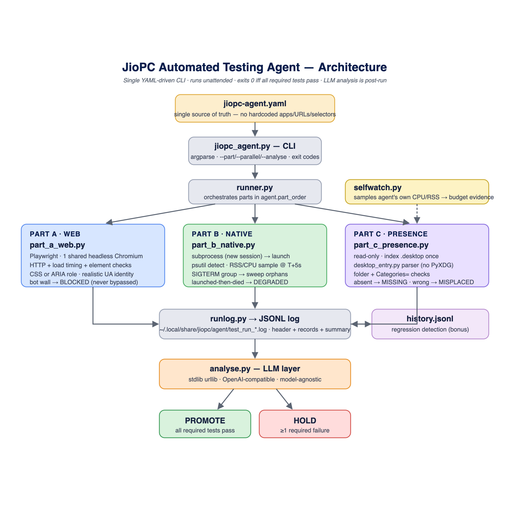

# Design Document

## Architecture

The JioPC Automated Testing Agent is composed of a runner core and three testing components, complemented by an LLM-powered log analysis script.



<details><summary>Text version of the diagram</summary>

```text
+-------------------+        +--------------------+
| jiopc-agent.yaml  | -----> | jiopc_agent.py CLI |
+-------------------+        +---------+----------+
                                       |
+--------------------------------------+--------------------------------------+
|                              runner.py                                      |
+-----------------------------------------------------------------------------+
|        Part A         |        Part B         |        Part C               |
|    (part_a_web.py)    |  (part_b_native.py)   |  (part_c_presence.py)       |
|  Playwright + Chrome  |   psutil + subprocess |  PyXDG (desktop_entry.py)   |
+-----------------------+-----------------------+-----------------------------+
|                               runlog.py                                     |
|                       (JSONL Output -> ~/.local/...)                        |
+--------------------------------------+--------------------------------------+
                                       |
                                       v
                           +------------------------+
                           | analyse.py (LLM Layer) |
                           +------------------------+
```

</details>

## Technology Choices & Justification
- **Language**: Python 3.10+ (Available on Ubuntu 24.04, rich ecosystem).
- **YAML Parsing**: `pyyaml` (Standard, widely used).
- **Part A (Web)**: Playwright with headless Chromium. Excellent modern JS handling, reliable element selectors, and robust load-timing APIs. Element checks accept **either a CSS selector or an accessible role** (`get_by_role`), matching the spec's "CSS selectors or accessible roles" and the way a real user/assistive tech perceives the page. The context presents a **realistic desktop-Chrome identity** (real UA, India locale/timezone, desktop viewport, `navigator.webdriver` masked) so legitimate Jio sites serve their normal page instead of false-flagging a headless bot — this is *not* CAPTCHA bypass (genuine challenge pages still log `BLOCKED` and are never solved). Transient navigation failures are retried (`web_retries`, default 1) so a one-off network blip never manufactures a HOLD.
- **Part B (Native)**: `psutil` + `subprocess`. Native cross-platform process tree visibility, straightforward VmRSS/CPU sampling, and clean termination.
- **Part C (Presence)**: Custom minimal `.desktop` parser (`desktop_entry.py`) matching freedesktop specs. Avoids heavy external dependencies like PyXDG.
- **LLM Analysis**: Standard library `urllib.request`. Zero-dependency OpenAI-compatible API client, ensuring the script is lightweight.

## YAML Schema Documentation
The `jiopc-agent.yaml` is the single source of truth for the agent.

- `agent`: Defines global settings (`log_dir`, `llm_prompt_file`, `part_order`, `fail_on`, pacing/timeouts, `web_retries`, and a `browser` block for the Part A headless-browser identity — `user_agent`, `locale`, `timezone_id`, `viewport_width/height`, `mask_webdriver`).
- `web_apps`: A list of dictionaries defining Part A targets (`name`, `url`, `load_time_threshold_ms`, `bot_detection_expected`, and expected `elements`). Each `elements` entry is **either** `{selector, ...}` (CSS) **or** `{role, name?, ...}` (accessible role), with an optional `state: attached|visible` (default `attached`).
- `native_apps`: A list defining Part B targets (`name`, `desktop_file`, `process_name`, `launch_timeout_s`).
- `desktop_presence`: A list defining Part C targets (`name`, `desktop_id`, `desktop_folder`, `start_menu_category`).

## Known Limitations
- The agent does not handle interactive desktop elements like modal dialogs or authentication prompts during Part B.
- CAPTCHA pages (Part A) are correctly logged as `BLOCKED` but cannot be bypassed.
- Process memory measurement relies on `VmRSS`, which may not precisely capture shared library usage in LxQt.
- The realistic browser identity reduces *false* bot-walls but does not defeat advanced anti-bot systems — TLS fingerprinting, behavioural analysis, and server-side IP reputation are out of scope and may still yield a (correctly logged) `BLOCKED`. This is intentional: the agent reports the wall, it never tries to beat it.
- `state: visible` asserts the element is rendered; elements that are legitimately collapsed (e.g. a nav behind a hamburger menu at the configured viewport) should use the default `attached` state instead.
- Flatpak apps (Part B) launch via `flatpak run <app-id>`; `process_name` must be the *real* app process, not `flatpak` (the resolver follows the `Exec=` wrapper, as it already does for the `soffice`→`soffice.bin` case).
- **Deliverables requiring the target VM:** `screenshots/` and `video/` (About JioPC §4.1) must be captured on the Ubuntu 24.04 + LxQt VM and are not produced by this repo; the benchmark numbers in `benchmarks/REPORT.md` were already measured there.
